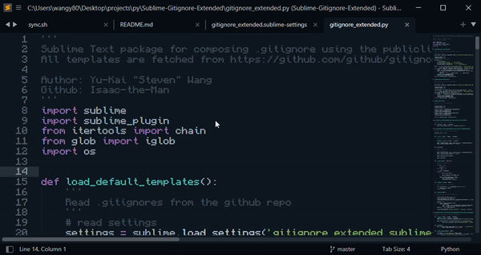
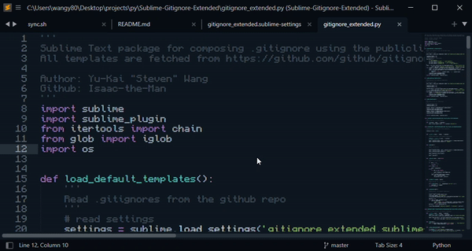
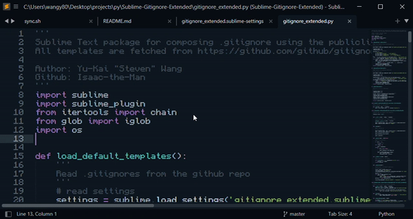
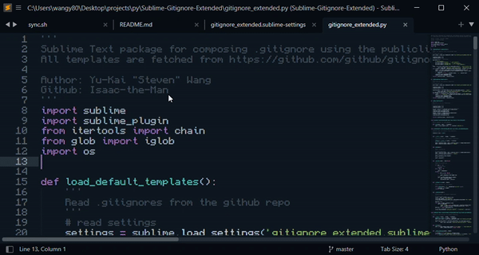

# Gitignore Extended

Sublime Text package for composing .gitignore using the publicliy maintained templates. All templates are fetched from [Github/gitignore](https://github.com/github/gitignore). 

This plugin allows you to compose a single .gitignore from multiple templates. It also enables you to create and store custom .gitignore templates for later uses. 

## Installation

Make sure you have [package-control](https://packagecontrol.io/installation) installed. 

Next run `ctrl + shift + p` -> `Install Package` -> `Gitignore Extended`. 

## Usage

Compose .gitignore from default template(s):

Create your own templates:

Edit your own templates:

Delete your own templates:

